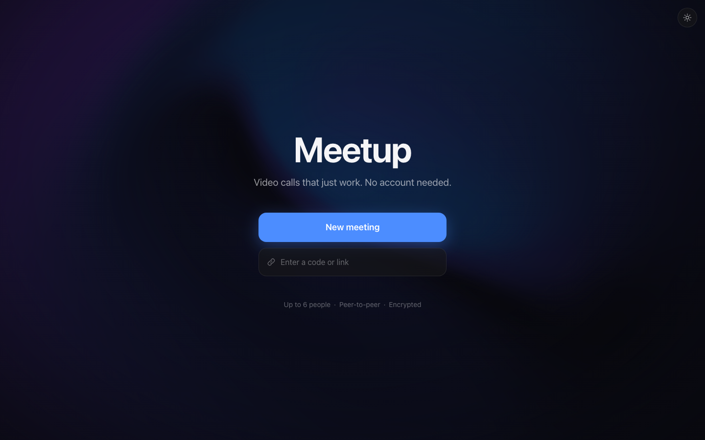
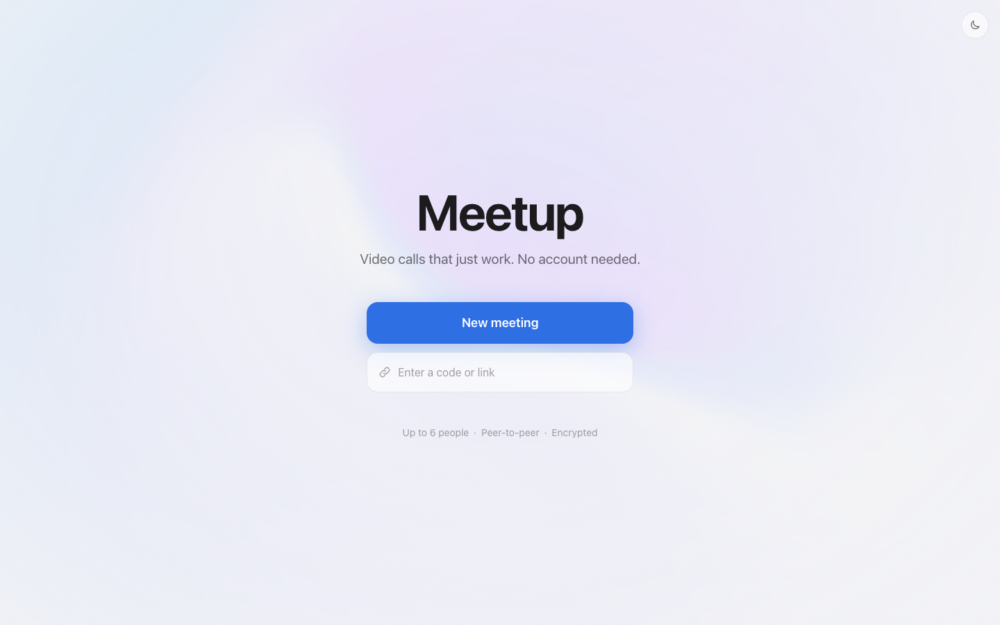
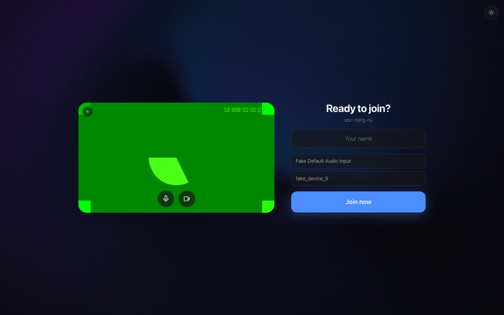
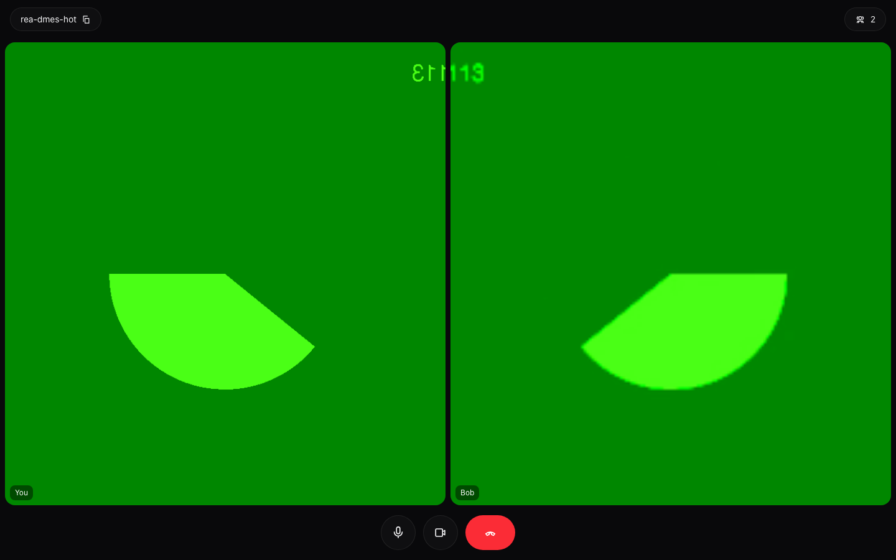
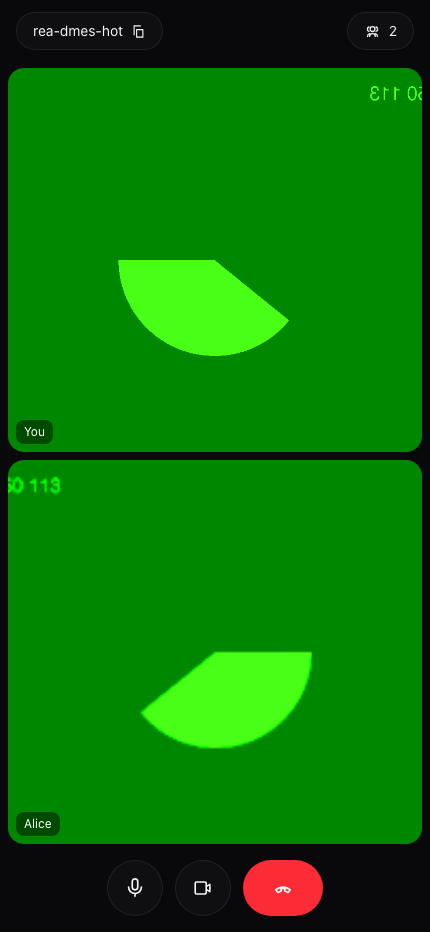

# Meetup

Google Meet–style video calls in the browser — create a link, share it, talk. No accounts, no database, no SDKs. Pure peer-to-peer WebRTC with a single tiny Node server for signaling.

**Live demo:** https://meetup-production-55f1.up.railway.app

<p align="center">
  
  
</p>

## Features

- **Instant meetings** — one click creates a link (`/r/abc-defg-hij`), anyone with it can join
- **Pre-join lobby** — camera preview, mic level meter, device pickers, join muted, or join with no devices at all
- **Up to 6 participants** over full-mesh P2P — media never touches the server
- **Host controls** — the meeting creator can mute anyone (they alone can unmute, like Meet)
- **Mobile-first** — iOS Safari + Android Chrome: touch controls, flip camera, wake lock, safe areas, `100dvh`
- **Auto-hiding chrome** — controls fade when idle, video goes edge-to-edge
- **Speaking indicators** via WebAudio, keyboard shortcuts (`m` mic, `v` camera)
- **Light/dark mode** with animated [Paper Shaders](https://github.com/paper-design/shaders) mesh-gradient backdrops
- **Adaptive quality** — outgoing video scales 720p → 360p as the room fills, protecting phone CPUs

<p align="center">
  
</p>
<p align="center">
  
  
</p>
<sub>The green feed in call screenshots is Chrome's fake test camera used by the automated E2E suite.</sub>

## Architecture

```
Browser A ──╮                        ╭── Browser B
            │   WebSocket signaling  │
            ╰──► Node (Express+ws) ◄─╯      media (SRTP)
                 serves SPA + relays        A ◄═══════════► B
                 offers/ICE/room state      peer-to-peer mesh
```

- **One process**: Express serves the built Vite/React SPA and handles WebSocket signaling on the same port. Rooms live in memory — they're ephemeral, like unscheduled Meet links.
- **Raw `RTCPeerConnection`** with the [perfect negotiation](https://developer.mozilla.org/en-US/docs/Web/API/WebRTC_API/Perfect_negotiation) pattern per peer pair; `replaceTrack` for camera switches without renegotiation.
- **LiveKit-shaped facade** — the client's `MeetRoom` class mirrors LiveKit's Room API, so migrating to an SFU for larger calls is an internals swap, not a rewrite.
- **Host tokens are stateless** — HMAC of the room id, so no room registry survives or needs to.
- STUN is free (Google); TURN via [Cloudflare Realtime](https://developers.cloudflare.com/realtime/turn/) (1 TB/mo free) for the ~15–20% of networks where P2P can't hole-punch.

## Run locally

```bash
npm install
npm run dev        # Vite on :5173, signaling server on :3000
```

Production build: `npm run build && npm start` → everything on :3000.

## Deploy

Runs anywhere a Node process can hold a WebSocket open (Railway, Fly, Render, a VPS). For Railway:

```bash
railway init && railway up
```

| Env var | Purpose |
|---|---|
| `SECRET` | HMAC key for host tokens (set once; random per boot otherwise) |
| `CF_TURN_KEY_ID` / `CF_TURN_API_TOKEN` | Cloudflare Realtime TURN (recommended for production) |
| `TURN_URL` / `TURN_USERNAME` / `TURN_PASSWORD` | any static TURN server instead |

## Roadmap

- [ ] Screen sharing
- [ ] In-call chat
- [ ] Recording
- [ ] SFU mode (LiveKit / Cloudflare Realtime) for calls beyond 6 people

## License

MIT
